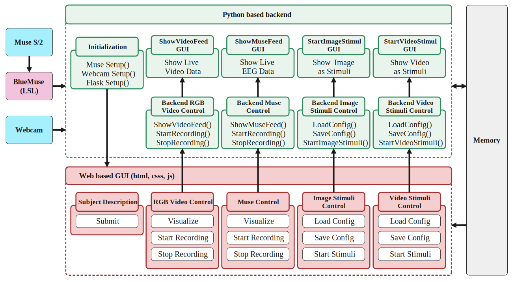

# NeuroCue

**NeuroCue** is an open-source, Python-based software framework for multi-modal data acquisition in EEG-based cognitive neuroscience research. It supports multi-modal data acquisition, including RGB video recordings from an integrated webcam, allowing the collection of facial expression and behavioral cues alongside EEG signals.




---

## ✨ Features

- 🎯 **Stimuli Presentation**
  - Supports image (.png), and video (.mp4) stimuli.
  - Load custom sequences via configuration files.
  - Real-time control panel interface.

- 🧠 **EEG Integration**
  - Connects with Muse EEG headset.
  - Real-time EEG data visualization (raw and sub-bands) and recording.

- 🎥 **Multimodal Recording**
  - Collect both EEG data and RGB video data.
  - Support for timestamped logs to ensure data alignment.

- 📦 **Modular & Open Source**
  - Designed for easy extension.
  - Fully open and free to use.

---

## ▶️ Watch Tutorial

[](https://youtu.be/zWrGUr24myQ)


## 🛠️ Installation

### 1. Clone the Repository

```bash
git clone https://github.com/mj-raihan/NeuroCue.git
cd NeuroCue
```

### 2. Install Dependencies

```bash
pip install -r requirements.txt
```

### 3. Run the Main Interface

```bash
python -m website.app
```

> ⚠️ **Important:** This software requires [BlueMuse](https://github.com/kowalej/BlueMuse) to be installed and running to stream EEG data from the Muse headset.  
> Please download and set up BlueMuse from their official GitHub repository: [https://github.com/kowalej/BlueMuse](https://github.com/kowalej/BlueMuse)

## 🔍 Citation
```bibtex
@article{raihan2025neurocue,
  title={NeuroCue: An Open-Source Framework for EEG Data Acquisition, multi-modal Recording, and Stimuli Presentation Using Muse Headsets},
  author={Raihan, Md. Johir; Tiang and Jun-Jiat and Nahid, Abdullah-Al},
  year={2025},
  note={Under Review}
}
```

## 📬 Contact
For questions, feedback, or collaborations:

**Md. Johir Raihan**<br>
Khulna University, Bangladesh. <br>
📧 mj.raihan2@gmail.com
